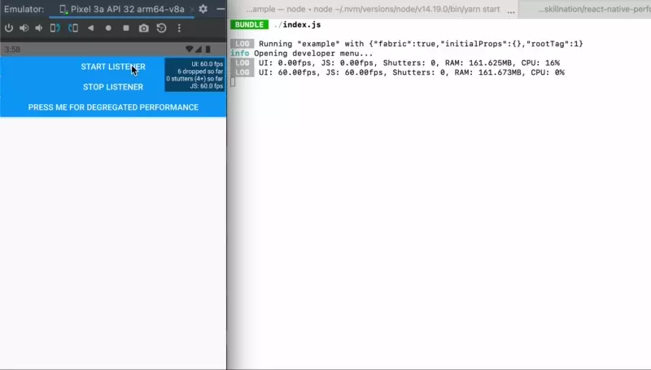

# 📱📊 react-native-performance-stats

Get performance metrics like UI Thread FPS, JS Thread FPS, App memory and CPU (just like the "Perf Monitor").



## Usage

```js
import PerformanceStats from "react-native-performance-stats";

useEffect(() => {
    const listener = PerformanceStats.addListener((stats) => {
        console.log(stats);
    });

    // you must call .start(true) to get CPU as well
    PerformanceStats.start();

    // ... at some later point you could call:
    // PerformanceStats.stop();

    return () => listener.remove();
}, []);
```

✅ Compatible with the new architecture (and backwards compatible with "old arch")


## Installation

```bash
yarn add react-native-performance-stats

npm i react-native-performance-stats
```

### iOS

Run pod install:

```bash
npx pod-install
```

### Android

No additional steps for android are required, except when using the new react native architecture:

<details>
    <summary>Click to expand for the instructions!</summary>

(_Note:_ This setup is required to to the fact that the on android Autolinking doesn't work with the new architecture out of the box. This procedure will change in the future.)

1. Open `android/app/build.gradle` file and update the file as it follows:
    ```diff
    defaultConfig {
        ...
        "PROJECT_BUILD_DIR=$buildDir",
        "REACT_ANDROID_DIR=$rootDir/../node_modules/react-native/ReactAndroid",
    -   "REACT_ANDROID_BUILD_DIR=$rootDir/../node_modules/react-native/ReactAndroid/build"
    +   "REACT_ANDROID_BUILD_DIR=$rootDir/../node_modules/react-native/ReactAndroid/build",
    +   "NODE_MODULES_DIR=$rootDir/../node_modules/"
        cFlags "-Wall", "-Werror", "-fexceptions", "-frtti", "-DWITH_INSPECTOR=1"
        cppFlags "-std=c++17"
    ```
1. Open the `android/app/src/main/jni/Android.mk` file and update the file as it follows:
    ```diff
        # If you wish to add a custom TurboModule or Fabric component in your app you
        # will have to include the following autogenerated makefile.
        # include $(GENERATED_SRC_DIR)/codegen/jni/Android.mk
    +
    +   # Includes the MK file for `react-native-performance-stats`
    +   include $(NODE_MODULES_DIR)/react-native-performance-stats/android/build/generated/source/codegen/jni/Android.mk
    +
        include $(CLEAR_VARS)
    ```
1. In the same file above, go to the `LOCAL_SHARED_LIBRARIES` setting and add the following line:
    ```diff
        libreact_codegen_rncore \
    +   libreact_codegen_performancestats \
        libreact_debug \
    ```
1. Open the `android/app/src/main/jni/MainApplicationModuleProvider.cpp` file and update the file as it follows:
    1. Add the import for the performance stats module:
        ```diff
            #include <answersolver.h>
        +   #include <performancestats.h>
        ```
    1. Add the following check in the `MainApplicationModuleProvider` constructor:
        ```diff
            // auto module = samplelibrary_ModuleProvider(moduleName, params);
            // if (module != nullptr) {
            //    return module;
            // }

        +    auto module = performancestats_ModuleProvider(moduleName, params);
        +    if (module != nullptr) {
        +        return module;
        +    }

            return rncore_ModuleProvider(moduleName, params);
        }
        ```
</details> 


## Caveats

- By default, no CPU usage will be tracked, as tracking adds a little overhead. Pass `true` to the `.start` function to track CPU as well.
- The FPS reported may not match 100% from what you see in the "Perf Monitor". However, the values are really close to each other and convey the same information.
  - Technically, this is due to the fact that we only "refresh" the FPS every 500ms in the native impl (so does the "Perf Monitor"). And the `react-native-performance-stats` may started tracking at another point in time than the "Perf Monitor", thus they refresh at different times.
- On android, the RAM usage may not match 100% from what you see when profiling the app. This is due to the fact that we can't read the Graphic's memory used by the app, while the profiler can. The difference between the numbers is usually not that big, as this is just for a [buffer queue to display pixels on screen](https://developer.android.com/studio/profile/memory-profiler.html).


